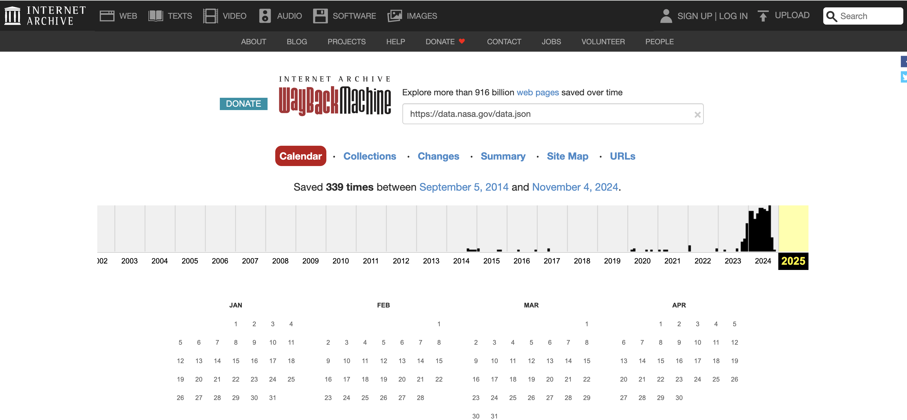

# data_dot_json_over_time
Prototype for seeing changes in data.json at NASA and other U.S. government agencies over
time using the Internet Archive's Wayback Machine.

_To jump down to lessons learned see the section [Early analysis learnings](#early-analysis-learnings)_

## Function

The purpose of the code in this repository is to analyze and compare snapshots of 
data.json JSON files that hold metadata of US government datasets.
It uses the [Internet Archive's snapshots](https://webcf.waybackmachine.org/) snapshots
of content that exists at different webpage URLs to find older data.json and 
then compare that to a data.json harvested from a live website today. 
This allows for comparison of how metadata in data.json files has changed over time. 

For example, one of the first questions analyzed is whether there are any dataset's
metadata that used to be in the data.json prior to January 20th, 2025 that is no longer
in a more recent data.json. Additionally, for these datasets do the datasets distribution
URLs still respond with a 200 request when hit or a 404 indicating the distribution download
page may have been removed.

Other questions may or may not be analyzed additionally over time if work on this side project
continues. 

## What is data.json and data.gov?

As part of the US government's federal open data policies and processes,
[data.gov](https://catalog.data.gov/dataset/) was stood up as a central catalog of dataset
metadata. There is a standardized metadata format and all U.S. government agencies were
required to create their own data.json file documenting their datasets in this format that
then got consumed into data.gov, which acts as a central catalog.

More details can be found at: 
- https://data.gov/user-guide/
- https://resources.data.gov/about/governance/
- https://resources.data.gov/resources/dcat-us/

### Why analyze US Government agency data.json 

As the centralized attempt to put dataset metadata in one place in one format, it is a
more obvious place to try to measure changes over time.
Additionally, because each agency has their own data.json (even if sometimes hard to find)
it enables analysis on the agency level as well.

### Complications of analyzing data.json files and data.gov

A high level list of reasons why things get complicated:

- Data.json and data.gov almost always lag actual data availability:
    - Data.json's are a lagging indicator. By the time datasets are removed from data.json they
        have likely already been removed from the actual download pages.
- Speed of updates is highly variable:
    - While some data is stored in systems that automatically send changes to data.gov and the system that updates each agency's data.json whenever the data itself changes, this is probably rare. In many cases, there can be a yearly
    or monthly "pull" of data from various data systems into data.json and data.gov. In some cases, metadata for a
    dataset in a data.json will only be changed if someone goes in and manually changes it.
- Nested systems:
    - Fundamentally, the metadata in data.json tends to be metadata description of a description
    of the metadata of another system. Sometimes there are 2 layers to this, sometimes 5 or 6.
    For example, at NASA there might be a dataset with one set of metadata from the system that collected it.
    That metadata is used to partially create the metadata fields in the system that stores it.
    There might be a catalog of conceptually similar datasets that consume that metadata to match its own
    format that goes across those conceptually similar datasets. Then NASA converts, shrinks, takes some
    of that  metadata to make its data.json at the agency level, which then gets consumed in data.gov
    metadata catalog.
- Not everything is simply singular file:
    - For datasets that get large, it is not uncommon to store them in systems that let a user extract
    just the parts they are concerned above. This is common for geospatial data where a system might
    let a user extract data for a particular area of coverage, date, version, and conceptual layer.
    As those change over time or how they are described changes in metadata it can appear as it
    large amount of data are removed or added in data.json when in fact no data is actually being removed.
- Versions:
    - The same dataset can also appear to disappear or multiple as different versions and edits of it appear.
    Sometimes older version are viewed as "not accurate" and removed but a newer and more accurate version still exists.


## How to use the code in this repository

### Structure 

There is a configuration yaml file at [`config.yml`](./config.yml) that holds details of which agency you want to harvest
a data.json from, which dates, and where output data should be saved. The Python files consume this information.
It is expected some users will not write any addition python code and just change a few variable in the
config.yml to harvest and analyze different agency data from different dates. The particulars of what to
change and what not to will get addressed further on.

The Python file [`src/tools.py`](./src/tools.py) holds a variety of small functions that act as tools or utilities.
If following the "assumed action" section below, you will not call any of these functions directly
but you might if you reuse them to analyze different aspects of data.json than initially targeted.

The Python file
[`src/get_list_available_snapshots_in_wayback_machine.py`](./src/get_list_available_snapshots_in_wayback_machine.py)
reads the config.yml file, gets the URL to the agency data.json you're after. It then sends that URL to the
Internet Archive's Wayback machine to get a listing of all the times the Waybak machine attempted to snapshot
that URL and whether the result was successful (200 status message) or some other http status message result.
The function processes this information into a JSON and saves it in the
`/data/{agency_name}/snapshots_available_in_archive/` folder. The filename is the date of when you made the
API call to get this information from the Wayback machine.


The Python file [`src/harvest.py`](./src/harvest.py) starts off doing the exact same thing as the
[`src/get_list_available_snapshots_in_wayback_machine.py`](./src/get_list_available_snapshots_in_wayback_machine.py)
file, but then additionally collects the data.json file from (1) the date(s) defined in the config.yml for the
wayback machine and (2) the current data.json that exists at the agency live URL for the data.json.
The [`src/get_list_available_snapshots_in_wayback_machine.py`](./src/get_list_available_snapshots_in_wayback_machine.py)
exists as its own function, because it is very likely people will want to see all the dates where a snapshot of the data.json
exists first and then decide which to ask the Wayback machine for. There can be 50 or 100 snapshots of some agency data.json.
Next, this function processes the data in those data.json to make it easier to analyze. As all URLs in the data.json from the
wayback machine are preceeded by the Wayback machine address, it removes those. Next to make comparison of data files easier
and faster, it changes the structure somewhat. In the data.json [DCAT](https://resources.data.gov/resources/dcat-us/)
format, each dataset is described by a separate object or dictionary with defined keys. All of those objects are in a big list.
To make comparison of data.json easier, we change the structure from a list to an object where the 'identified' field is extracted
from the object and make into a key for each object.

A non-processed example snippet of a data.json is below. Each dataset is described in a object {} that follows a format defined in
[DCAT](https://resources.data.gov/resources/dcat-us/). 

```
datasets:
[
        {
            "accessLevel": "public",
            "landingPage": "https://pds.nasa.gov/ds-view/pds/viewDataset.jsp?dsid=RO-E-RPCMAG-2-EAR2-RAW-V3.0",
            "bureauCode": [
                "026:00"
            ],
            "issued": "2018-06-26",
            "@type": "dcat:Dataset",
            "modified": "2023-01-26",
            "references": [
                "https://pds.nasa.gov"
            ],
            "keyword": [
                "international rosetta mission",
                "unknown",
                "earth"
            ],
            "contactPoint": {
                "@type": "vcard:Contact",
                "fn": "Thomas Morgan",
                "hasEmail": "mailto:thomas.h.morgan@nasa.gov"
            },
            "publisher": {
                "@type": "org:Organization",
                "name": "National Aeronautics and Space Administration"
            },
            "identifier": "urn:nasa:pds:context_pds3:data_set:data_set.ro-e-rpcmag-2-ear2-raw-v3.0_222f-2gsy",
            "description": "This dataset contains EDITED RAW DATA of the second Earth Flyby (EAR2). The closest approach (CA) took place on November 13, 2007 at 20:57",
            "title": "ROSETTA-ORBITER EARTH RPCMAG 2 EAR2 RAW V3.0",
            "programCode": [
                "026:005"
            ],
            "distribution": [
                {
                    "@type": "dcat:Distribution",
                    "downloadURL": "https://www.socrata.com",
                    "mediaType": "text/html"
                }
            ],
            "accrualPeriodicity": "irregular",
            "theme": [
                "Earth Science"
            ]
        },
        {'another datasets metadata object here'},
        {'another datasets metadata object here'},
        .....
]
```
Once we have the data in an object instead a list, comparison of two data.json to find
differences is a little faster. The `missing_keys` sub-directory is where we put the
results of these comparisons. We also create a json that attempts to hit every
landing page URL and dataset distribution URL with a link checker to see what the status
of each link is in order to find 404s.

Example snippet of what this gets us is a list of datasets that don't exist in the more
recent data.json but did exist in an older one and a check for whether the URLs associated
with those datasets are active or not.

For example in the example below, all the data is for dataset identifiers that existed in the
older data.json that don't exist in a younger version.
The URL `"https://disc.gsfc.nasa.gov/datacollection/MICASA_FLUX_3H_1.html"`
is one datasets download distribution point and `"20250206001603"` is the date and time
it was checked and `200` was the status result, meaning the page responded that it was still there.

```
            "C3273640138-GES_DISC": {
                "accessLevel": "public",
                "landingPage": "https://doi.org/10.5067/AS9U6AWVTY69",
                "bureauCode": [
                    "026:00"
                ],
                "citation": "Brad Weir. 2024-09-25. MICASA_FLUX_3H. Version 1. MiCASA 3-hourly NPP NEE Fluxes 0.1 degree x 0.1 degree. Greenbelt, MD, USA. Archived by National Aeronautics and Space Administration, U.S. Government, Goddard Earth Sciences Data and Information Services Center (GES DISC). https://doi.org/10.5067/AS9U6AWVTY69. https://disc.gsfc.nasa.gov/datacollection/MICASA_FLUX_3H_1.html. Digital Science Data.",
                "issued": "2024-09-22",
                "temporal": "2001-01-01T00:00:00Z/2023-12-31T23:59:59.999Z",
                "@type": "dcat:Dataset",
                "modified": "2024-09-22",
                "keyword": [
                    "carbon flux",
                    "climate indicators",
                    "earth science"
                ],
                "data-presentation-form": "Digital Science Data",
                "contactPoint": {
                    "@type": "vcard:Contact",
                    "fn": "Brad Weir",
                    "hasEmail": "mailto:brad.weir@nasa.gov"
                },
                "publisher": {
                    "@type": "org:Organization",
                    "name": "NASA/GSFC/SED/ESD/ESISL/GESDISC"
                },
                "identifier": "C3273640138-GES_DISC",
                "description": "MiCASA is an extensive revision of CASA-GFED3. CASA-GFED3 derives from Potter et al. (1993), diverging in development since Randerson et al. (1996). CASA is a light use efficiency model: NPP is expressed as the product of photosynthetically active solar radiation, a light use efficiency parameter, scalars that capture temperature and moisture limitations, and fractional absorption of photosynthetically active radiation (fPAR) by the vegetation canopy derived from satellite data. Fire parameterization was incorporated into the model by van der Werf et al. (2004) leading to CASA-GFED3 after several revisions (van der Werf et al., 2006, 2010). Development of the GFED module has continued, now at GFED5 (Chen et al., 2023) with less focus on the CASA module. MiCASA diverges from GFED development at version 3, although future reconciliation is possible. Input datasets include air temperature, precipitation, incident solar radiation, a soil classification map, and several satellite derived products. These products are primarily based on Moderate Resolution Imaging Spectroradiometer (MODIS) Terra and Aqua combined datasets including land cover classification (MCD12Q1), burned area (MCD64A1), Nadir BRDF-Adjusted Reflectance (NBAR; MCD43A4), from which fPAR is derived, and tree/herbaceous/bare vegetated fractions from Terra only (MOD44B). Emissions due to fire and burning of coarse woody debris (fuel wood) are estimated separately.",
                "release-place": "Greenbelt, MD, USA",
                "series-name": "MICASA_FLUX_3H",
                "creator": "Brad Weir",
                "title": "MiCASA 3-hourly NPP NEE Fluxes 0.1 degree x 0.1 degree",
                "graphic-preview-file": "https://docserver.gesdisc.eosdis.nasa.gov/public/project/CMS/micasa_v1_sample.jpg",
                "programCode": [
                    "026:001"
                ],
                "distribution": [
                    {
                        "mediaType": "text/html",
                        "downloadURL": "https://scholar.google.com/scholar?q=10.5067%2FAS9U6AWVTY69",
                        "description": "Search results for publications that cite this dataset by its DOI.",
                        "@type": "dcat:Distribution",
                        "title": "Google Scholar search results"
                    },
                    {
                        "@type": "dcat:Distribution",
                        "downloadURL": "https://docserver.gesdisc.eosdis.nasa.gov/public/project/CMS/micasa_v1_sample.jpg",
                        "mediaType": "image/jpeg",
                        "title": "Get a related visualization"
                    },
                    {
                        "mediaType": "text/html",
                        "downloadURL": "https://disc.gsfc.nasa.gov/datacollection/MICASA_FLUX_3H_1.html",
                        "description": "Access the dataset landing page from the GES DISC website.",
                        "@type": "dcat:Distribution",
                        "title": "This dataset's landing page"
                    },
                    {
                        "mediaType": "text/html",
                        "downloadURL": "https://acdisc.gsfc.nasa.gov/data/CMS/MICASA_FLUX_3H.1/",
                        "description": "Access the data via HTTPS.",
                        "@type": "dcat:Distribution",
                        "title": "Download this dataset through a directory map"
                    },
                    {
                        "mediaType": "text/html",
                        "downloadURL": "https://acdisc.gsfc.nasa.gov/opendap/CMS/MICASA_FLUX_3H.1/",
                        "description": "Access the data via the OPeNDAP protocol.",
                        "@type": "dcat:Distribution",
                        "title": "Use OPeNDAP to access the dataset's data"
                    },
                    {
                        "mediaType": "application/pdf",
                        "downloadURL": "https://acdisc.gsfc.nasa.gov/data/CMS/MICASA_FLUX_D.1/doc/MiCASA_README.pdf",
                        "description": "README Document",
                        "@type": "dcat:Distribution",
                        "title": "View this dataset's read me document"
                    },
                    {
                        "mediaType": "text/html",
                        "downloadURL": "https://search.earthdata.nasa.gov/search?q=MICASA_FLUX_3H",
                        "description": "Use the Earthdata Search to find and retrieve data sets across multiple data centers.",
                        "@type": "dcat:Distribution",
                        "title": "Download this dataset through Earthdata Search"
                    }
                ],
                "spatial": "-180.0 -90.0 179.0 90.0",
                "theme": [
                    "CMS",
                    "geospatial"
                ],
                "language": [
                    "en-US"
                ],
                "url_status_checks": {
                    "distributions_downloadURLs": {
                        "https://disc.gsfc.nasa.gov/datacollection/MICASA_FLUX_3H_1.html": {
                            "20250206001603": 200
                        },
                        "https://docserver.gesdisc.eosdis.nasa.gov/public/project/CMS/micasa_v1_sample.jpg": {
                            "20250206001603": 200
                        },
                        "https://acdisc.gsfc.nasa.gov/opendap/CMS/MICASA_FLUX_3H.1/": {
                            "20250206001603": 200
                        },
                        "https://scholar.google.com/scholar?q=10.5067%2FAS9U6AWVTY69": {
                            "20250206001603": 429
                        },
                        "https://acdisc.gsfc.nasa.gov/data/CMS/MICASA_FLUX_D.1/doc/MiCASA_README.pdf": {
                            "20250206001603": 200
                        },
                        "https://acdisc.gsfc.nasa.gov/data/CMS/MICASA_FLUX_3H.1/": {
                            "20250206001603": 200
                        },
                        "https://search.earthdata.nasa.gov/search?q=MICASA_FLUX_3H": {
                            "20250206001603": 200
                        }
                    },
                    "landingPage": {
                        "https://doi.org/10.5067/AS9U6AWVTY69": {
                            "20250206001603": 200
                        }
                    }
                }
            },
```

### Assumed user steps to use these python scripts

As noted above, the lower level functions in the tools.py file could probably be
reused for different analysis, but initially this is just targeting questions of 
_"What datasets don't exist in a more recent data.json metadata file and do the download
URLs associated with them 404?"_

#### 1. Find the data.json URL

This is less easy than expected. There used to be a listing of URLS where you could find
each agency data.json, but I couldn't locate it. It is possible that page is no longer
public or no longer exists. 

Example URLS for live agency data.json:
- https://data.nasa.gov/data.json
- https://www.commerce.gov/sites/default/files/data.json
- https://data.ed.gov/data.json

The data.gov resources page suggest agency's make them available at the following
URL structure `https://www.agency.gov/data.json`. However, that's often probably
difficult as the front page of agencies tends to be produced from a content management
platform that doesn't allow for a direct download URL at that location.

It is possible, similar data might be extracted from the data.gov CKAN API and put into
a DCAT formatted JSON, but this hasn't been tried yet. Doing a web search and
spending a few minutes to look around will likely help you find an agency's data.json
URL in many cases.

#### 2. Make changes to the config.yml

If you're adding a new agency to the yaml, copy the existing YAML structure and change these fields.

1. Change `name` key's value
2. Change `agency_live_data_json_link` key's value
3. Change `base_agency_path:` key's value
4. Change `dates_to_pull` key's value

5. Change which agency python scripts run for in the config.yml field `agency_name_to_run_now`

The config.yml is set up roughly following the a structure such that multiple agencies
can be documented in the config.yml but only called one at a time. In the example below,
the data for NASA would be collected as it is the first agency listed and the value for
the key `agency_name_to_run_now` is one.

```
agencies:
  - agency_name_to_run_now: 1
  - NASA:
    - {more key:values pairs here specific to the agency in question} 
  - ANOTHER_AGENCY:
    - {more key:values pairs here specific to the agency in question} 
  - ANOTHER_AGENCY:
    - {more key:values pairs here specific to the agency in question} 
```


#### 3. (optional) run [`src/get_list_available_snapshots_in_wayback_machine.py`](./src/get_list_available_snapshots_in_wayback_machine.py)

You can get timestamps of when the Internet Archive's Wayback Machine has snapshots
of a data.json in two ways. 

(A.) You can manually go to https://web.archive.org/ and put in the URL of the location that the
live agency data.json is found in the wayback search bar.
An example of a direct URL to the wayback page for NASA's data.json is [https://web.archive.org/web/20250000000000*/https://data.nasa.gov/data.json](https://web.archive.org/web/20250000000000*/https://data.nasa.gov/data.json).
From there, you can see when snapshot's of the JSON occurred. 



(B.) Alternatively, you could run the
[`src/get_list_available_snapshots_in_wayback_machine.py`](./src/get_list_available_snapshots_in_wayback_machine.py)
script by running from root in a terminal `python src/get_list_available_snapshots_in_wayback_machine.py`.

You will need an active python environment with the packages in the `requirements.txt` file for this.
This script will print a json in the `snapshots_available_in_archive` sub-folder with the same information.

#### 4. Run [`src/harvest.py`](./src/harvest.py) 

In a terminal from the top of the directory run `python src/harvest.py`. It will likely take a few
minutes for the script to complete it's work. Information should be printed to the terminal as it runs.


#### 5. Look at or visualize the results

These will be in the results folder `/data/{agency_name}/missing_keys/{date1}_vs_{date2}_missing_keysInSecondNoTitleMatch.json`

Eventually, a webpage may be build to make understanding the results easier.


## Early analysis learnings

### Missing datasets

#### Data.json lags reality 

Department of Education and Department of Commerce (NOAA and others) don't have any datasets
missing in data.json across the Biden/Trump administration boundary. Given reports of at least
some NOAA datasets being taken down, at least temporarily, this may reflect data.json lagging
reality, meaning updates to data.json likely occur some time after they dataset access has
been removed or datasets no longer exist. 

#### Some removed dataset identifiers appear to be version updates or identifier changes with no other changes but not all

Of the 3 agencies in the initial analysis set, only NASA's' data.json showed datasets
identifiers in the first snapshot not present in the second snapshot, totally 198 dataset identifiers.
This compares data.json snapshots on 2024-10-09 and 2025-02-07.

Of those 198, it seems at least 33 were situations where the datset identifer changed but the
title did not, suggesting these might just be identifer changes related to underlying system
updates or version updates that didn't change dataset title.

Of those 198, another 32 had nearly the same dataset title with only the last part of the
title changed in a way consistent with version updates. For example a long title and then 
the end has "-v3" instead of "-v2". 

Both of those situations likely do not reflect dataset removal so much as dataset evolution over time.

148 of 198 did not fall into those two previous situation and require additional analysis to see
if they are true dataset removals. Most of those 148 have landing page and distribution URls
that give 200 status messages or mostly do, suggesting that data is still available.
Others give 403 messages suggesting there is a need to sign in first, especially for
some earth data systems that assume a user is signed in. There is a smaller subset that
may indeed be gone but current programmatic checks here do not ensure this with high accuracy yet.

##### In progress work to visualize comparison results

There is an incomplete process to build a webpage that visualizes information from the
JSONs in a static webpage without needing to look at the admittedly big and complex
JSONs themselves. See the `/visualizations/` directory. One issue to work around is that
the JSONs are large enough that this repository is using LFS (Git Large File Storage)
to store them in the GitHub repository, this is fine, except when you attempt to have
JavaScript read the JSONs in a deployed website, it then doesn't work as it is not a
JSON any longer but a LFS reference. This means we'll probably need a python 
script to be run that extract relevant high level metrics from the comparison
JSON and then put that data into a file or file format that doesn't get converted
to LFS, perhaps a YAML file?

_This work is in flux._


### Possible future analysis pathways suggested by this analysis
 
Some of the missing dataset's whose metadata doesn't appear in the more recent data.json
have several dataset distribution URLs listed as well as a landing page. For several of the
datasets, only some of the URLs return 404 statuses and others 200 or other statues.
There might be value in analyzing those statuses and seeing if it possible to
programmatically recognize when a landing page might be down but a download
distribution URL still be up as those might be targets for archiving.

## Contributing 

This repository is currently being used for experiments to see how much use
analysis of agency level data.json might be for understanding availability of
U.S. government federal open data. It is a very narrow analysis.
There are lots of other efforts in the broader space. 

If you have questions or want to get in touch on
related efforts/analysis leave an issue on this repository or find my contact email.